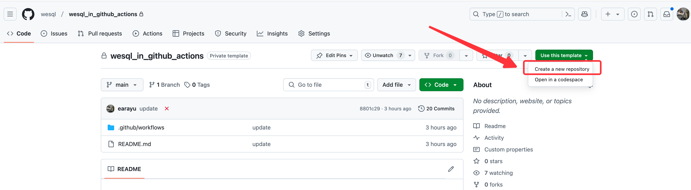
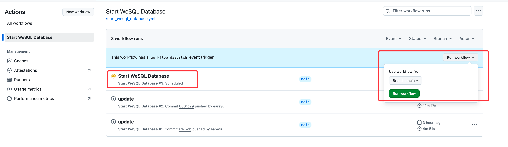
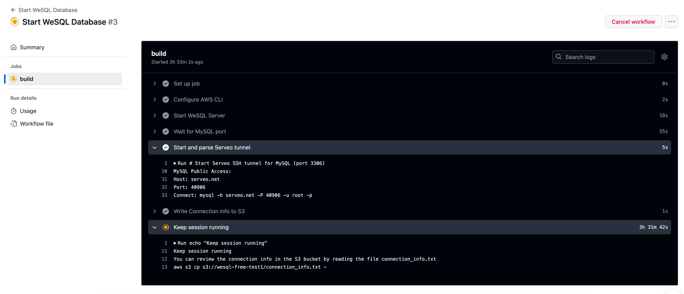
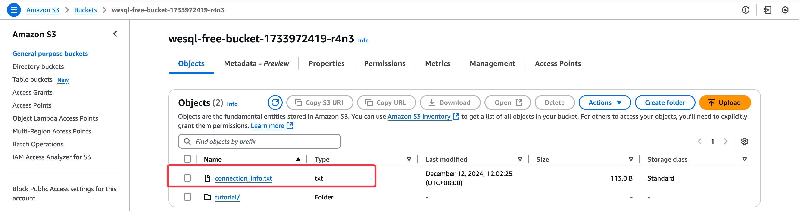

本项目是在Github Actions中运行WeSQL数据库
[Cloudflare R2](https://github.com/pzb568/wesql_in_github_actions/blob/main/README.md)的方法说明，可以参考原版[ApeCloud S3](https://github.com/wesql/wesql_in_github_actions/blob/main/README.md)

1. 使用此模板创建新存储库


2. 配置 Github Actions 所需的 Secret
[start_wesql_database.yml](.github%2Fworkflows%2Fstart_wesql_database.yml) 需要在存储库设置中配置以下密钥：

WESQL_OBJECTSTORE_ACCESS_KEY #r2访问密钥ID 

WESQL_OBJECTSTORE_SECRET_KEY #r2机密访问密钥
 
WESQL_OBJECTSTORE_BUCKET #存储桶的名字如websql
 
WESQL_OBJECTSTORE_REGION #r2存储桶地区如us-east-1
 
WESQL_OBJECTSTORE_ENDPOINT_URL #r2存储S3 API地址
 
WESQL_ROOT_PASSWORD # MySQL数据库的root密码


3. 触发 Github Actions
[start_wesql_database.yml](.github%2Fworkflows%2Fstart_wesql_database.yml) 可能是自动触发的，您也可以手动触发。不用担心并发性，最近一次运行会取消上一次运行。


4. 检查 Github Actions 日志


5. 检查 WeSQL 数据库连接信息
可以查看 S3 存储桶中 WeSQL 数据库的连接信息：


可以使用以下 AWS CLI 命令获取连接信息：

```bash
$ aws s3 cp s3://wesql-free-bucket-1733972419-r4n3/connection_info.txt -
host=serveo.net
port=40906
username=root
password=<your-root-password>
mysql_cli=mysql -h serveo.net -P 40906 -u root -p<your-root-password>
```

6. 连接到 WeSQL 数据库
```bash
$ mysql -h serveo.net -P 40906 -u root -p<your-root-password>
```


